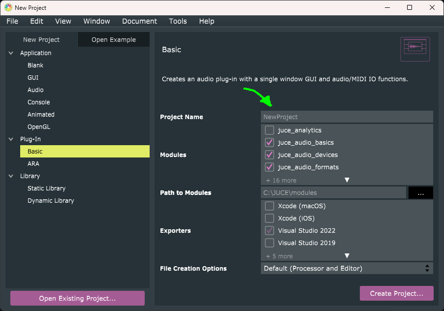

# MakoThump
* JUCE VST3 Guitar EQ.
* Tested on Windows only.
* Written in Visual C++ 2022.
* Written for new programmers, not complicated.
* Version: 1.10
* Posted: June 2, 2024

VERSION
------------------------------------------------------------------
1.00 - Initial release.
       
1.10 - Bug fixes.   

DISCLAIMER
------------------------------------------------------------------  
This VST was written in a very simple way. No object defs, etc. 
Just simple code for people who are not programmers but want to 
dabble in the magic of JUCE VSTs. Dont look at the code as
something to master. But a tool you can create with. You dont need
to know how the hammer was made. Just use it. Let JUCE carry you.
       
SUMMARY
------------------------------------------------------------------
A Juce/C++ VST3 written to add EQ and bass boost options to guitar.


This VST adds some useful high gain guitar tools.

LOW PASS FILTER (High Cut)<br />
Most guitars are recorded with 12" speakers. These speakers do not
reproduce sounds above 5 kHz very well. A hi cut is useful to tame
the fizz and distortion, by removing the higher frequencies.

5 BAND EQ<br />
There are several EQ setups created. Each one can be used to create
the tone you are looking for.

MAKO THUMP<br />
Large speaker cabinets are resonant boxes. They usually create a
low freq boost around 150 - 200 Hz. Speakers will also begin to
go into a compression state at very high volumes. To emulate these
two things, we create a 150 Hz low pass filter and pass it thru a
distortion stage. This is then mixed with the original signal.By
adding Thump and reducing the low bass with the EQ, you can tweak
a much more lively sound.  

CORE PROCESSING<br />
The audio process that does the work is called:<br />
```C++
float MakoBiteAudioProcessor::Thump_ProcessAudio(float tSample, int channel)
```

The editor has basic JUCE slider controls that alter processor
variables and set a flag that our vars need updated. For this app
that means our filters need to be recalculated. I do this in the
processor so the variables are not trying to be changed while
being used in the processor. <br />
```C++
//R1.00 Update our Filters.  
Filter_LP_Coeffs(150.0f, &makoF_Thump);  
Filter_BP_Coeffs(Pedal_Band1, Band1_Freq, Band1_Q, &makoF_Band1);  
Filter_BP_Coeffs(Pedal_Band2, Band2_Freq, Band2_Q, &makoF_Band2);  
Filter_BP_Coeffs(Pedal_Band3, Band3_Freq, Band3_Q, &makoF_Band3);  
Filter_BP_Coeffs(Pedal_Band4, Band4_Freq, Band4_Q, &makoF_Band4);  
Filter_BP_Coeffs(Pedal_Band5, Band5_Freq, Band5_Q, &makoF_Band5);  
Filter_LP_Coeffs(Pedal_LP, &makoF_LP);  
```

 These functions calculate filters using fixed frequencies and
 Qs. The vars Pedal_Bandx are dB volume values adjusted in the 
 editor.

 The bulk of this VST is just applying filters. With the exception
 of Thump. Which uses a hypertangent to distort the low signal. 

 ```C++
 tSThump = tanhf(tSThump * Pedal_Thump * 5.0f);
```  
 tanhf allows you to amplify a signal but keep the peak value
 between -1 and 1. Which are the limits needed for audio programming.

 # BASIC JUCE OPERATION<br />
 
 This app is setup in JUCE by creating a basic Plug-In. Once 
 created four files are placed in the SOURCE directory for the 
 project. Replace those four files with the files from this app
 and you are ready to go. The files are:
 
 PluginEditor.h  
 PluginEditor.cpp  
 PluginProcessor.h  
 PluginProcessor.cpp  

 The processor is always running in a DAW. The editor is not.
 It will be loaded and destroyed every time you switch VSTs.
 These two things may be running on seperate CPU threads.<br />

 The editor and processor need to speak to each other. This is done
 thru PUBLIC variables defined in PluginProcessor.h. In the
 editor you use the processor object name to get the values.<br />
 ```C++
 audioProcessor.Pedal_Gain
```         

# PARAMETERS<br />
 A VST should have parameters. These are variables that get
 loaded, saved, and adjusted by the DAW. The magic of JUCE is 
 streamling that process. But you need several things defined for
 it to work.

 A Slider control in the editor to adjust the value:  
```C++
juce::Slider jsP1_Gain;
```  

A Parameter Attachment to track the parameter in the editor:  
```C++
std::unique_ptr <juce::AudioProcessorValueTreeState::SliderAttachment> ParAtt_Gain;  
ParAtt_Gain  = std::make_unique <juce::AudioProcessorValueTreeState::SliderAttachment>(p.parameters, "gain", jsP1_Gain);
```

A Value State Tree to store the parameters in the processor:  
```C++
juce::AudioProcessorValueTreeState parameters;
```  

Parameter defintions in processor:  
```C++
parameters(*this, nullptr, "PARAMETERS", {
   std::make_unique<juce::AudioParameterFloat>("gain","Gain", -1.0f, 1.0f, .0f),
```

Parameter Get/Set functions with this code:<br />
```C++
//R1.00 Save our parameters to file/DAW.    
auto state = parameters.copyState();    
std::unique_ptr<juce::XmlElement> xml(state.createXml());    
copyXmlToBinary(*xml, destData);  

//R1.00 Read our parameters from file/DAW.  
std::unique_ptr<juce::XmlElement> xmlState(getXmlFromBinary(data, sizeInBytes));  
if (xmlState.get() != nullptr)  
    if (xmlState->hasTagName(parameters.state.getType()))    
        parameters.replaceState(juce::ValueTree::fromXml(*xmlState));  
```

In some instances you may need to pull a parameter value. This can be done with:  
```C++
Pedal_Thump = makoGetParmValue_float("thump");
```

# JUCE SLIDER CONTROL<br />
First you need to define a slider object in teh editor.h file:  
```C++
juce::Slider jsP1_Thump;
```
Then you need to define some stuff about the object in editor.cpp:  
```C++
 jsP1_Thump.setRange(0.0, 1.0, .01);
 jsP1_Thump.setValue(audioProcessor.Pedal_Thump);
 jsP1_Thump.addListener(this);
 addAndMakeVisible(jsP1_Thump);
```
The next step is to define where the slider will be on the UI. This is usually in the RESIZED function:  
```C++
jsP1_Thump.setBounds(100, 15, 80, 100);
```
Now we need to intercept changes to the slider so we can track/update our variables/parameters. Here we are setting
a variable called SettingsChanged to flag the processor that it needs to recalcuate some things.  
```C++
void MakoBiteAudioProcessorEditor::sliderValueChanged(juce::Slider* slider)
{    
    if (slider == &jsP1_Thump)
    {
        audioProcessor.Pedal_Thump = float(jsP1_Thump.getValue());
        audioProcessor.SettingsChanged = true;  //R1.00 We need to update settings in processor.
    }
}
```

 
 
 
 
 
 


