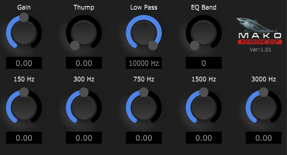

# MakoThump
* JUCE VST3 Guitar EQ.
* Tested on Windows only.
* Written in Visual C++ 2022.
* Written for new programmers, not complicated.
* Version: 1.10
* Posted: June 2, 2024

VERSION
------------------------------------------------------------------
1.00 - Initial release.
       
1.10 - Bug fixes.   
       
SUMMARY
------------------------------------------------------------------
A Juce/C++ VST3 written to add EQ and bass boost options to guitar.

This VST adds some useful high gain guitar tools.

LOW PASS FILTER (High Cut)

Most guitars are recorded with 12" speakers. These speakers do not
reproduce sounds above 5 kHz very well. A hi cut is useful to tame
the fizz and distortion, by removing the higher frequencies.

5 BAND EQ

There are several EQ setups created. Each one can be used to create
the tone you are looking for.

MAKO THUMP

Large speaker cabinets are resonant boxes. They usually create a
low freq boost around 150 - 200 Hz. Speakers will also being to
go into a compression state at very high volumes. To emulate these
two things, we create a 150 Hz low pass filter and pass it thru a
distortion stage. By adding Thump and reducing the low bass with
the EQ, you can tweak a much more lively sound.

